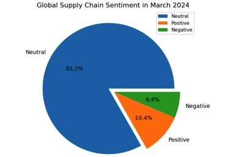
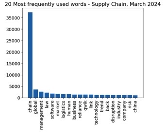
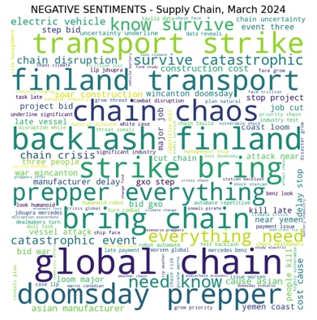
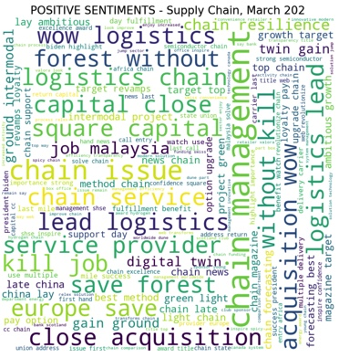

# Supply-Chain-Sentiment-Analysis
The global supply chain is a crucial driver of the world economy, enabling the movement of goods and services worldwide and directly impacting economic growth. Analyzing sentiment surrounding the global supply chain in March 2024 reveals whether it's positive or negative, offering insights into improvements and disruptions.

In March 2024, the global supply chain is experiencing a predominantly positive sentiment, as indicated by a sentiment analysis of over 23,260 news articles related to "supply chain" gathered from Google News. The sentiment analysis, with a high accuracy of 98.37%, reveals that 10.4% of the sentiment is positive, 6.4% is negative, and the majority, 83.2%, is neutral [Figure 1].

#### Figure 1: News sentiments regarding supply chain management 

## Sentiment Analysis Results

I performed sentiment analysis on the data. `sklearn`'s `confusion matrix` and `accuracy_score` was utilized to evaluate the classification model's performance. The model accuracy is calculated as (TP + TN) / (TP + TN + FP + FN), which is 0.9837 or approximately 98.37%. This indicates that the model is performing very well on the test data, with a high percentage of correct predictions.

## Factors Influencing Sentiment

1. Legislation and Human Rights: European Union countries are backing new human rights supply chain laws, reflecting a positive development towards ethical and responsible supply chain management.
2. Technological Advancements: Advancements in AI are shaping the supply chain landscape, with technologies such as software solutions playing a significant role. However, there are also mentions of "threats" associated with the software industry, highlighting areas of concern.
3. Key Industry Players: Companies like Qwik, a major buyer of Indian electronic bonds, and Reliance, a multinational conglomerate based in India, are influencing supply chain sentiments. These companies likely have significant impacts on the global supply chain due to their operations and decisions.
4. Global Influence of China: China's control over raw material supply chains is a crucial factor affecting sentiment. The nation's role in the global supply chain ecosystem is substantial and closely watched.

## Word Analysis

Most Used Words includes [Figure 2]:
1. "law"
2. "late"
3. "oracle"
4. "software"
5. "attack"
6. "china"
7. "resilience"
8. "reliance"
9. "qwik"
10. "technology"

#### Figure 2: Most Used Words 

Negative Sentiment Words includes [Figure 3]:
1. "finland"
2. "canadian industry"
3. "transport strike"
4. "threat software"
5. "war wincanton"

#### Figure 3: Words used in Negative Sentiment

Positive Sentiment Words includes [Figure 4]:
1. "semiconductor"
2. "job malaysia"
3. "save forest"
4. "intermodal"
5. "europe save"

#### Figure 4: Words used in Positive Sentiment

## Insights and Conclusion

The positive sentiment is supported by several factors. The development of semiconductor production is a notable highlight, likely indicating growth in technological sectors and potentially increased efficiency in supply chains. Job growth in Malaysia suggests economic expansion and stability, contributing positively to the overall sentiment.

Despite the positive outlook, challenges remain. Issues such as transportation and threats from the software industry are highlighted as areas that need attention within the supply chain. It is evident that stakeholders are actively navigating these challenges while also embracing opportunities for growth and sustainability.

In conclusion, while there are areas of concern, the global supply chain in March 2024 maintains an optimistic outlook. The sentiment analysis provides valuable insights into the industry's current state, highlighting both positive developments and challenges that stakeholders are addressing. This analysis is crucial for understanding the dynamics of the global supply chain and its impact on the broader economy.
   
